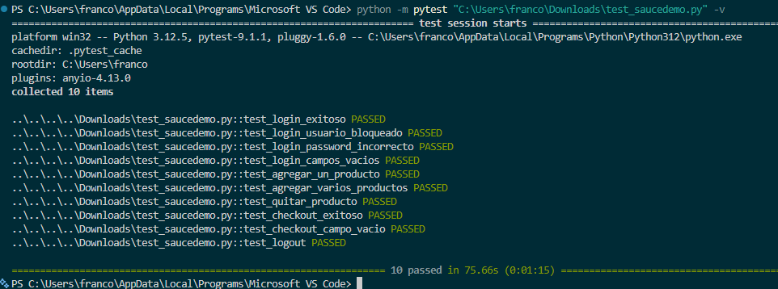

# QA Portfolio — SauceDemo + ReqRes API


Proyecto de práctica de aseguramiento de calidad de software (QA), enfocado en demostrar el ciclo completo de pruebas: diseño de casos de prueba manuales, automatización de pruebas UI, validación de una API REST e integración continua (CI/CD).

## Qué incluye este repositorio

| Archivo | Descripción |
|---|---|
| `casos_de_prueba.md` | Plan de pruebas manual con 10 casos de prueba sobre [SauceDemo](https://www.saucedemo.com/), cubriendo login, carrito y checkout |
| `test_saucedemo.py` | Automatización de esos 10 casos con Selenium WebDriver + pytest |
| `ReqRes_QA_Collection.postman_collection.json` | Colección de Postman con pruebas de API (GET, POST, PUT, DELETE) sobre [ReqRes](https://reqres.in) |
| `requirements.txt` | Dependencias de Python del proyecto |
| `.github/workflows/tests.yml` | Workflow de GitHub Actions que ejecuta los tests automáticamente en cada push |

## Integración continua (CI/CD)

Cada vez que se hace push a la rama `main`, GitHub Actions ejecuta automáticamente los 10 tests de Selenium en un navegador Chrome headless, sin intervención manual. El resultado (passing/failing) se refleja en el badge de arriba y los reportes quedan disponibles como artefacto descargable en la pestaña "Actions" del repositorio.

## Herramientas utilizadas

- **Selenium WebDriver** — automatización de pruebas de interfaz
- **pytest** — framework de ejecución y aserciones
- **Postman** — pruebas de API y validación de contratos de respuesta
- **Python**

## Cómo ejecutar las pruebas de Selenium

```bash
pip install selenium pytest
pytest test_saucedemo.py -v
```

Requiere tener Chrome instalado. Selenium Manager (incluido desde Selenium 4.6+) descarga el driver automáticamente.

## Cómo ejecutar la colección de Postman

1. Abrir Postman
2. Importar `ReqRes_QA_Collection.postman_collection.json`
3. Ejecutar la colección completa con el botón "Run"

4. ## Resultados

-----------------------------------------

-----------------------------------------


## Sobre este proyecto

Este repositorio fue creado como ejercicio de práctica para consolidar conocimientos de QA: diseño de casos de prueba, automatización UI y pruebas de API, usando sitios públicos de práctica (SauceDemo y ReqRes).
